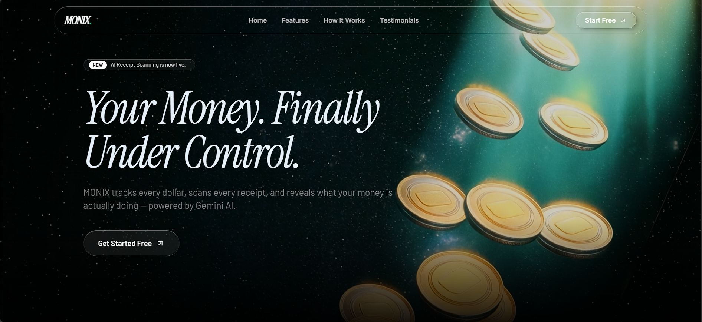

# MONIX – AI-Powered Money Management Platform



## 🌟 Overview  
💰 **MONIX** is an AI-powered money management platform built to help you seamlessly track your **income** and **expenses** across multiple accounts. Featuring smart categorization, **AI receipt scanning**, budget alerts, and monthly AI-powered financial insights, MONIX brings smart financial discipline to your daily life.

## 🌟 Features
* ✅ **Multi-Account Management** – Track income & expenses across various accounts  
* ✅ **Smart Categorization** – Automatically categorize your transactions  
* ✅ **AI-Powered Receipt Scanning** – Upload and auto-fill data via scanned receipts  
* ✅ **Budget Management** – Set budgets, get alerts at 80% threshold  
* ✅ **Recurring Transactions** – Automatically add recurring payments/incomes  
* ✅ **Advanced Filtering** – Search and filter through all transactions with ease  
* ✅ **Interactive Visualizations** – Graphs powered by **Recharts** for daily insights  
* ✅ **Monthly AI Insights** – Get end-of-month analysis with personalized AI insights  
* ✅ **Modern UI** – Built with **ShadCN** and **TailwindCSS**  
* ✅ **Secure Authentication** – Powered by **Clerk**  
* ✅ **Bot Protection** – Integrated with **Arcjet**  
* ✅ **Automated Reports** – Delivered monthly via **Inngest** automation  

## 🔗 Live Demo
Check out **MONIX** in action: **[Live Link](https://monix-three.vercel.app)** 🚀

## 💻 Tech Stack
| Category       | Technology                                 |
|----------------|---------------------------------------------|
| **Frontend**   | Next.js, TailwindCSS, ShadCN                |
| **Backend**    | Next.js Server Actions, Prisma              |
| **AI**         | Gemini API                                  |
| **Database**   | Supabase                                    |
| **Charts**     | Recharts                                    |
| **Auth**       | Clerk                                       |
| **Automation** | Inngest                                     |
| **Bot Defense**| Arcjet                                      |
| **Forms**      | React Hook Form, Zod                        |
| **Deployment** | Vercel                                      |

## 📥 Installation

### Clone the repository:
```bash
git clone https://github.com/anjany06/monix.git
cd monix
```

### Install dependencies:
```bash
npm install
```

### Set up environment variables:
1. Copy `.env.example` to `.env`
2. Fill in all required keys:
   - Supabase URL & Key
   - Clerk keys
   - Gemini API key
   - Inngest config
   - Any other necessary env variables

### Initialize the database:
```bash
npx prisma generate
npx prisma migrate dev
```

### Start the development server:
```bash
npm run dev
```

## 🤝 Contribution Guidelines

### 🌱 How to Get Involved
1. Fork the repository.
2. Clone your fork:
   ```bash
   git clone https://github.com/your-username/monix.git
   ```
3. Create a new branch:
   ```bash
   git checkout -b feature/<feature-name>
   ```
4. Make changes and commit:
   ```bash
   git add .
   git commit -m "Your descriptive commit message"
   ```
5. Push changes:
   ```bash
   git push origin <your-branch-name>
   ```
6. Open a pull request.

## 🌟 Stargazers & Forkers
We appreciate your support! 🌟🍴

## 🛡 License
MONIX is licensed under the **MIT License**.

## 📬 Contact
For queries or collaborations:  
📧 **Email:** anjany.pandey06@gmail.com  
💼 **LinkedIn:** [https://www.linkedin.com/in/anjany-pandey-927169294/](https://www.linkedin.com/in/anjany-pandey-927169294/)  
🐦 **Twitter/X:** [https://x.com/anjany06](https://x.com/anjany06)
